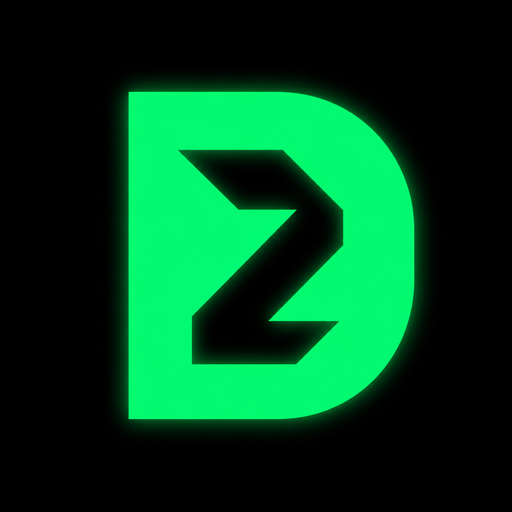

<p align="center">
  
</p>

<h1 align="center">decoder sec.</h1>

<p align="center">
  <strong>Premium iOS proxy client</strong><br/>
  Xray · sing-box · mihomo — your configs, your rules.
</p>

<p align="center">
  <a href="https://github.com/decoder-dev/decoder-sec/actions/workflows/build-ipa.yml"></a>
  <a href="https://github.com/decoder-dev/decoder-sec/releases"></a>
</p>

## About

**decoder-sec** is a native Swift iOS app for managing proxy tunnels with a dark neon brand and Happ-compatible deep links for one-tap subscription import.

- Packet Tunnel Network Extension
- Engines via [EverywhereCore](https://github.com/NodePassProject/EverywhereCore): **Xray**, **sing-box**, **mihomo**
- OLED black + neon green UI
- `happ://add/…`, routing profiles, share-links (`vless://`, `vmess://`, …)
- IPA builds on GitHub Actions

## Identity

| | |
|---|---|
| Display name | `decoder sec.` |
| Project | `DecoderSec.xcodeproj` |
| Targets | `DecoderSec` · `DecoderSecTunnel` |
| Bundle ID | `com.decodersec.app` |
| Packet Tunnel | `com.decodersec.app.PacketTunnel` |

[BRAND.md](./BRAND.md) · [DEEPLINKS.md](./DEEPLINKS.md) · [FORK.md](./FORK.md) · [CHANGELOG.md](./CHANGELOG.md) · [Releases](./docs/RELEASES.md)

## Downloads

Prerelease IPAs: **[GitHub Releases](https://github.com/decoder-dev/decoder-sec/releases)** (unsigned — resign before install).

## Build

```bash
git clone https://github.com/decoder-dev/decoder-sec.git
cd decoder-sec
./build.sh
open DecoderSec.xcodeproj
```

```bash
./Scripts/ci_export_ipa.sh   # unsigned IPA → build/ipa/
```

Requires Xcode 16+ and an Apple Team with Network Extension for the IDs above. No App Group.

## License

GPLv3 — see [LICENSE](./LICENSE).

Upstream cores: Xray-core, sing-box, mihomo.  
Lineage: [NodePassProject/Everywhere](https://github.com/NodePassProject/Everywhere).
