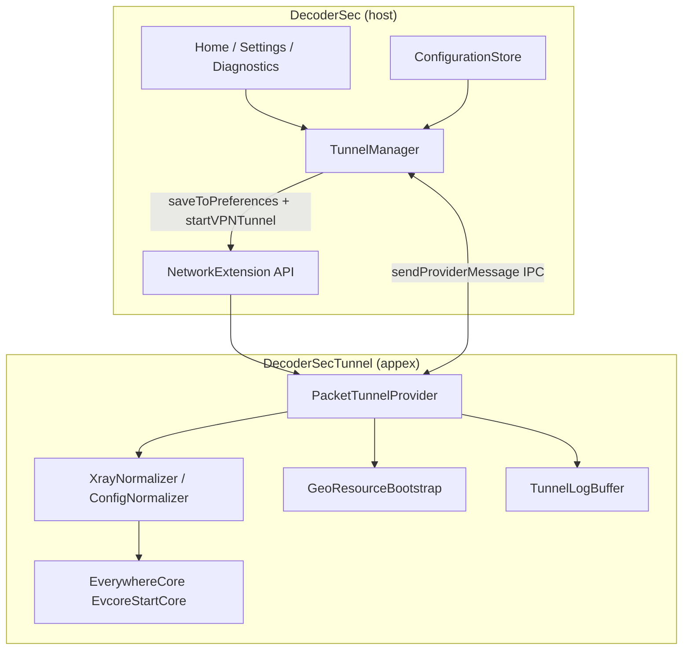
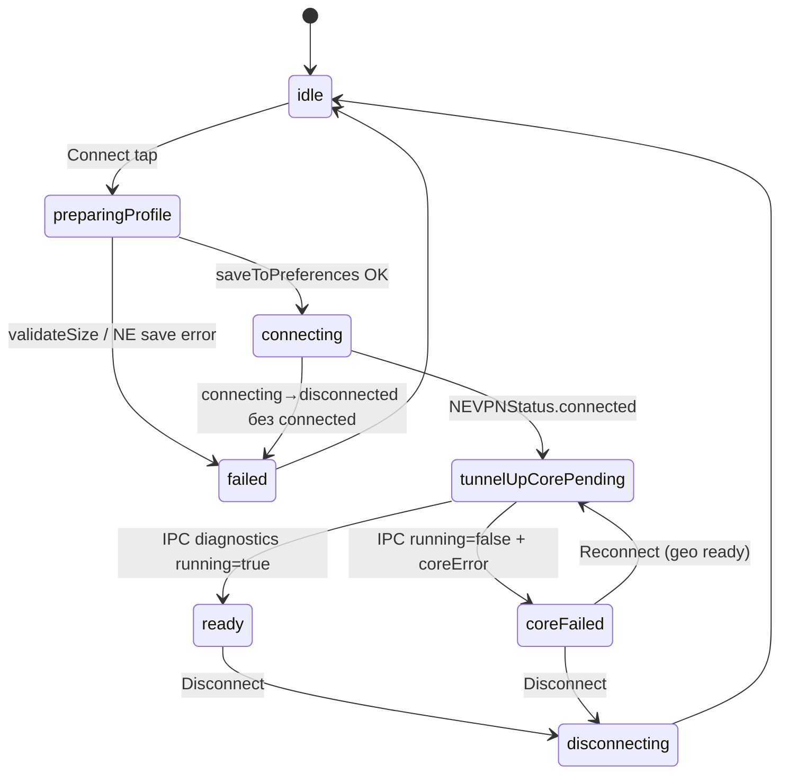
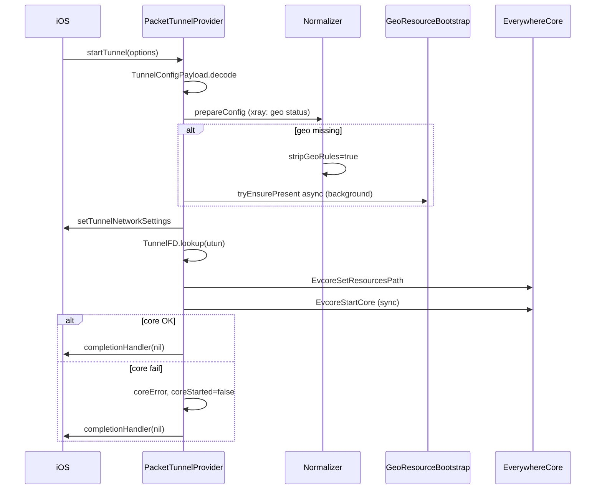

# Tunnel architecture scheme — decoder sec.

Согласованная схема старта VPN / Xray между **host app** и **Packet Tunnel extension**, выверенная по паттернам [NodePassProject/Everywhere](https://github.com/NodePassProject/Everywhere), [useruserdev/happwn](https://github.com/useruserdev/happwn) и практикам Apple Network Extension.

## 1. Участники и границы



| Компонент | Контейнер | Роль |
|-----------|-----------|------|
| Host app | `Application Support/DecoderSec/` | UI, Core Data, профиль VPN |
| Packet Tunnel | **отдельный** `Application Support/DecoderSec/` | geo `.dat`, runtime ядра |
| App Group | **нет** | конфиг передаётся inline; geo не шарится |

**Критично:** файлы в Settings → Resources пишутся в sandbox **приложения**. Extension их **не видит**, пока не настроен App Group. Geo для Xray загружается **только внутри extension** при старте туннеля.

## 2. Контракт конфигурации

Единый тип: `Shared/Tunnel/TunnelConfigPayload.swift`.

| Ключ | Тип | Куда |
|------|-----|------|
| `configContent` | String (JSON) | `providerConfiguration` **и** `startVPNTunnel(options:)` |
| `configID` | String | wire parity, diagnostics |
| `coreType` | String | xray / mihomo / sing-box |
| `dnsServers` | [String] | TUN DNS в `NEPacketTunnelNetworkSettings` |
| `useZashboard` | Bool | Clash API / Dashboard в NE |

**Декодирование в extension:** `options` → fallback `providerConfiguration` (on-demand / системный рестарт без options).

**Лимит размера:** `validateSize()` — не более **512 KiB** UTF-8 на `configContent`. Большие подписки (много outbound) могут не пройти сериализацию NE plist; ошибка показывается **до** `saveToPreferences`.

## 3. Жизненный цикл подключения



`TunnelLifecyclePhase` в app зеркалит эту машину для UI и Diagnostics (поверх `NEVPNStatus` + `coreRunning` + `lastError`).

### Почему `startVPNTunnel` не бросает ошибку ядра

Apple вызывает `startTunnel` асинхронно. `startVPNTunnel()` возвращает успех, когда запрос принят системой. Ошибки extension:

1. **До** `completionHandler(nil)` — VPN может не перейти в `.connected` → `trackConnectFailures` + log IPC.
2. **После** TUN up, **EvcoreStartCore** fail — Everywhere-паттерн: `completionHandler(nil)`, NE остаётся `.connected`, ошибка через IPC (`coreError`).

## 4. Последовательность `startTunnel` (extension)



### Бюджет времени NE (~30 s)

| Действие | Блокирует startTunnel? |
|----------|------------------------|
| normalize JSON | да, быстро |
| **скачивание geo .dat** | **нет** (beta.25+) |
| setTunnelNetworkSettings | да, async callback |
| EvcoreStartCore | да, sync |
| path monitor | после успеха |

При отсутствии geo: правила `geosite:`/`geoip:` **strip**, balancer **flatten** → catch-all на proxy. Трафик идёт без geo-сплитов до повторного connect после фоновой загрузки.

## 5. Xray normalize (Happ / v2rayN)

`XrayNormalizer` перед стартом:

- Оставляет только **TUN** inbound, добавляет sniffing (http/tls/quic).
- Убирает desktop inbounds, `observatory`, DNS `localhost`.
- `routing.balancers` удаляются; правила с `balancerTag` → fallback outbound.
- При `stripGeoRules`: фильтр `geosite:` / `geoip:` в rules.
- Catch-all rule на proxy, `domainStrategy: IPIfNonMatch`.

Детекция geo-зависимости: parse `routing.rules` (string **или** array) + DNS `domains` + substring fallback.

## 6. IPC (app ↔ extension)

| type | Направление | Ответ |
|------|-------------|-------|
| `diagnostics` / `core-status` | app → NE | running, error, geo*, resourcesPath, sessionSeconds |
| `logs` | app → NE | ring buffer строк |
| `clear-logs` | app → NE | ok |
| `traffic` | app → NE | up/down (Clash API если Dashboard; Xray — unavailable) |

Polling: `TunnelManager.refreshCoreStatus` / `captureStartupFailureReason` с backoff при failed connect.

## 7. Диагностика типовых сбоев

| Симптом | Вероятная причина | Где смотреть |
|---------|-------------------|--------------|
| Connect → сразу disconnected | startTunnel throw до TUN; missing config; NE entitlement | Log console, last line |
| Connected, Core running: no | EvcoreStartCore fail; geo strip | Diagnostics → coreError |
| «Connection failed before tunnel came up» | extension умер до IPC; timeout transition | Log console; beta.25+ тянет реальную строку |
| Geo rules stripped | нет .dat в **extension** container | Diagnostics geo rows; reconnect после download |
| 26 subscription refresh failed | HWID / crypt / HTTP | Subscribe errors; Settings HWID |

## 8. Приоритеты доработок

### P0 (beta.26)

- [x] Убрать geo pre-warm из app (`TunnelManager`) — бесполезен для NE.
- [x] `TunnelConfigPayload.validateSize()` перед persist.
- [x] `TunnelLifecyclePhase` + публикация в `TunnelManager`.
- [x] Parse-based geo detection в `GeoResourceBootstrap`.
- [x] Пояснение в Settings → Resources про разные контейнеры.

### P1

- [ ] Bundled minimal `geoip.dat` / `geosite.dat` в `DecoderSecTunnel` target (copy on first run).
- [ ] Auto-reconnect когда фоновая geo-загрузка завершилась и `geoStripped` был true.
- [ ] App Group **только** для `Resources/` (опционально, product decision).

### P2

- [ ] Ссылка config по hash + малый payload в NE (если лимит 512 KiB станет узким).
- [ ] Unit tests: `XrayNormalizer`, `GeoResourceBootstrap`, `TunnelConfigPayload.decode`.
- [ ] Structured os_log в extension вместо только ring buffer.

## 9. Upstream references

| Repo | Что взяли |
|------|-----------|
| [Everywhere](https://github.com/NodePassProject/Everywhere) | sync EvcoreStartCore, completionHandler(nil) on core fail, inline config |
| [happwn](https://github.com/useruserdev/happwn) | crypt5 decrypt, HWID headers, subscription resolver |
| sing-box-for-apple | TunnelFD retry, utun selection |

## 10. Файловая карта

```
Shared/Tunnel/TunnelConfigPayload.swift   — wire contract + size guard
Shared/Tunnel/TunnelLifecyclePhase.swift  — app-side phase enum
Shared/Runtime/GeoResourceBootstrap.swift — geo status + download
Shared/Normalizer/XrayNormalizer.swift    — Happ-safe normalize
DecoderSec/Core/TunnelManager.swift       — NE lifecycle, IPC, phases
DecoderSecTunnel/PacketTunnelProvider.swift — startTunnel pipeline
docs/TUNNEL_SCHEME.md                     — этот документ
```
