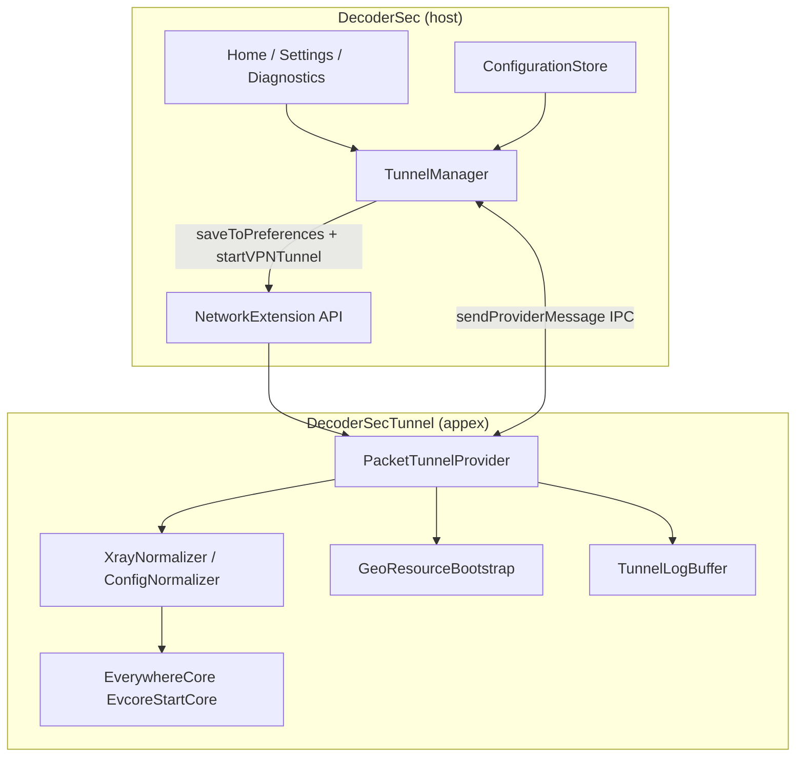
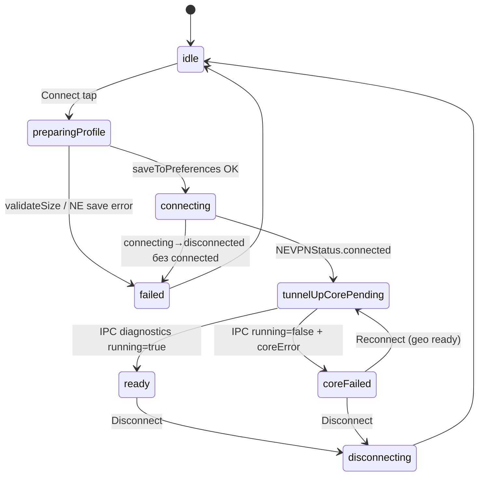
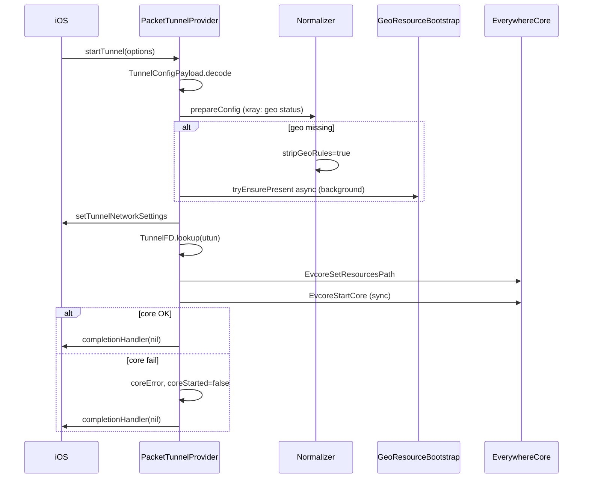
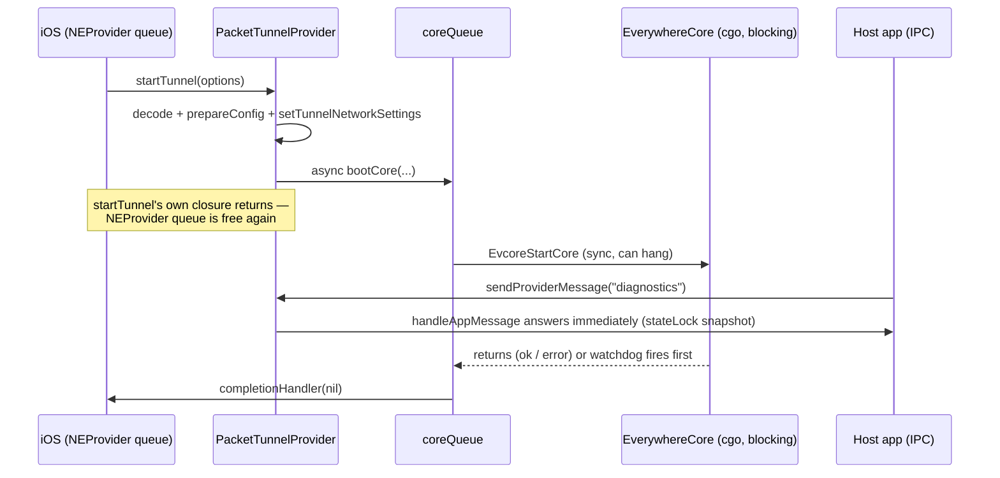

# Tunnel architecture scheme — decoder sec.

Согласованная схема старта VPN / Xray между **host app** и **Packet Tunnel extension**, выверенная по паттернам [NodePassProject/Everywhere](https://github.com/NodePassProject/Everywhere), [useruserdev/happwn](https://github.com/useruserdev/happwn) и практикам Apple Network Extension.

## 1. Участники и границы



| Компонент | Контейнер | Роль |
|-----------|-----------|------|
| Host app | `Application Support/DecoderSec/` | UI, Core Data, профиль VPN |
| Packet Tunnel | **отдельный** `Application Support/DecoderSec/` | geo `.dat`, runtime ядра |
| App Group | **нет** | конфиг передаётся inline; geo не шарится |

**Критично:** файлы в Settings → Resources пишутся в sandbox **приложения**. Extension их **не видит**, пока не настроен App Group. Geo для Xray загружается **только внутри extension** при старте туннеля.

## 2. Контракт конфигурации

Единый тип: `Shared/Tunnel/TunnelConfigPayload.swift`.

| Ключ | Тип | Куда |
|------|-----|------|
| `configContent` | String (JSON) | `providerConfiguration` **и** `startVPNTunnel(options:)` |
| `configID` | String | wire parity, diagnostics |
| `coreType` | String | xray / mihomo / sing-box |
| `dnsServers` | [String] | TUN DNS в `NEPacketTunnelNetworkSettings` |
| `useZashboard` | Bool | Clash API / Dashboard в NE |

**Декодирование в extension:** `options` → fallback `providerConfiguration` (on-demand / системный рестарт без options).

**Лимит размера:** `validateSize()` — не более **512 KiB** UTF-8 на `configContent`. Большие подписки (много outbound) могут не пройти сериализацию NE plist; ошибка показывается **до** `saveToPreferences`.

## 3. Жизненный цикл подключения



`TunnelLifecyclePhase` в app зеркалит эту машину для UI и Diagnostics (поверх `NEVPNStatus` + `coreRunning` + `lastError`).

### Почему `startVPNTunnel` не бросает ошибку ядра

Apple вызывает `startTunnel` асинхронно. `startVPNTunnel()` возвращает успех, когда запрос принят системой. Ошибки extension:

1. **До** `completionHandler(nil)` — VPN может не перейти в `.connected` → `trackConnectFailures` + log IPC.
2. **После** TUN up, **EvcoreStartCore** fail — Everywhere-паттерн: `completionHandler(nil)`, NE остаётся `.connected`, ошибка через IPC (`coreError`).

## 4. Последовательность `startTunnel` (extension)



### Бюджет времени NE (~30 s)

| Действие | Блокирует startTunnel? |
|----------|------------------------|
| normalize JSON | да, быстро |
| **скачивание geo .dat** | **нет** (beta.25+) |
| setTunnelNetworkSettings | да, async callback |
| EvcoreStartCore | да, sync |
| path monitor | после успеха |

При отсутствии geo: правила `geosite:`/`geoip:` **strip**, balancer **flatten** → catch-all на proxy. Трафик идёт без geo-сплитов до повторного connect после фоновой загрузки.

## 5. Xray normalize (Happ / v2rayN)

`XrayNormalizer` перед стартом:

- Оставляет только **TUN** inbound, добавляет sniffing (http/tls/quic).
- Убирает desktop inbounds, `observatory`, DNS `localhost`.
- `routing.balancers` удаляются; правила с `balancerTag` → fallback outbound.
- При `stripGeoRules`: фильтр `geosite:` / `geoip:` в rules.
- Catch-all rule на proxy, `domainStrategy: IPIfNonMatch`.

Детекция geo-зависимости: parse `routing.rules` (string **или** array) + DNS `domains` + substring fallback.

## 6. IPC (app ↔ extension)

| type | Направление | Ответ |
|------|-------------|-------|
| `diagnostics` / `core-status` | app → NE | running, error, geo*, resourcesPath, sessionSeconds |
| `logs` | app → NE | ring buffer строк |
| `clear-logs` | app → NE | ok |
| `traffic` | app → NE | up/down (Clash API если Dashboard; Xray — unavailable) |

Polling: `TunnelManager.refreshCoreStatus` / `captureStartupFailureReason` с backoff при failed connect.

## 7. Диагностика типовых сбоев

| Симптом | Вероятная причина | Где смотреть |
|---------|-------------------|--------------|
| Connect → сразу disconnected | startTunnel throw до TUN; missing config; NE entitlement | Log console, last line |
| Connected, Core running: no | EvcoreStartCore fail; geo strip | Diagnostics → coreError |
| «Connection failed before tunnel came up» | extension умер до IPC; timeout transition | Log console; beta.25+ тянет реальную строку |
| Geo rules stripped | нет .dat в **extension** container | Diagnostics geo rows; reconnect после download |
| 26 subscription refresh failed | HWID / crypt / HTTP | Subscribe errors; Settings HWID |

## 8. Приоритеты доработок

### P0 (beta.37)

- [x] Tier-3 **minimal boot**: if ios-safe + geo-strip fail/hang, extract ≤3 proxy outbounds into a
      known-good tun+DNS+catch-all skeleton so `EvcoreStartCore` still succeeds when ≥1 outbound parses.

### P0 (beta.32)

- [x] `EvcoreStartCore`/`SetResourcesPath`/`StopAll` на отдельном `coreQueue` — `handleAppMessage`
      больше не стоит в очереди позади зависшего/медленного старта ядра.
- [x] Retry с `stripGeoRules: true`, когда `EvcoreStartCore` падает на отсутствующей geosite/geoip
      категории (файл есть, категории нет — Xray падает сразу, не по таймауту).
- [x] Balancer flatten учитывает `selector` каждого balancer (как v2rayNG `getBalance()`), а не всегда
      `proxy`.
- [x] DNS sanitize не оставляет конфиг без catch-all резолвера после strip `localhost`.

### P0 (beta.26)

- [x] Убрать geo pre-warm из app (`TunnelManager`) — бесполезен для NE.
- [x] `TunnelConfigPayload.validateSize()` перед persist.
- [x] `TunnelLifecyclePhase` + публикация в `TunnelManager`.
- [x] Parse-based geo detection в `GeoResourceBootstrap`.
- [x] Пояснение в Settings → Resources про разные контейнеры.

### P1

- [x] Bundled minimal `geoip.dat` / `geosite.dat` в `DecoderSecTunnel` target (copy on first run).
- [x] Auto-reconnect когда фоновая geo-загрузка завершилась и `geoStripped` был true.
- [ ] App Group **только** для `Resources/` (опционально, product decision).

### P2

- [ ] Ссылка config по hash + малый payload в NE (если лимит 512 KiB станет узким).
- [ ] Unit tests: `XrayNormalizer`, `GeoResourceBootstrap`, `TunnelConfigPayload.decode`.
- [ ] Structured os_log в extension вместо только ring buffer.

## 9. Upstream references

| Repo | Что взяли |
|------|-----------|
| [Everywhere](https://github.com/NodePassProject/Everywhere) | sync EvcoreStartCore, completionHandler(nil) on core fail, inline config |
| [happwn](https://github.com/useruserdev/happwn) | crypt5 decrypt, HWID headers, subscription resolver |
| sing-box-for-apple | TunnelFD retry, utun selection |

## 11. Android reference (Happ / v2rayNG)

| Client | Geo strategy | Lesson for iOS |
|--------|--------------|----------------|
| **Happ** | Pre-installed geo in app; routing profile has `Geoipurl` / `Geositeurl` for updates | Geo must exist **before** core start — not optional CDN on first connect |
| **v2rayNG** | `geoip.dat` / `geosite.dat` in APK assets → `SettingsManager.initAssets()` copies to app data on first launch | Same: bundle in appex, `seedBundledGeoIfNeeded` into extension container |
| **decoder sec.** (beta.29+) | `ThirdParty/geo/` in Packet Tunnel bundle, roscomvpn lists | Strip geo only when bundled + container both miss files |
| **decoder sec.** (beta.30+) | dual `EvcoreStartCore`: minimal JSON first, hardened fallback | Matches libv2ray «load config as provider gave it» |
| **decoder sec.** (beta.32+) | file-exists check is not enough — retry with `stripGeoRules` forced when Xray reports a missing category | v2rayN/2dust issue trackers: unknown geosite/geoip category is a **hard fail**, not a soft warning |

Upstream [Everywhere](https://github.com/NodePassProject/Everywhere) uses App Group + user-managed Resources — we keep inline config but adopted Android-style **bundled geo seed**.

### 11.1 What `getV2rayCustomConfig` actually does (and why we still diverge)

`V2rayConfigManager.getV2rayCustomConfig` — the v2rayNG path for a full provider-supplied JSON
config (Happ's use case) — does almost nothing to the JSON: it checks for an existing `tun` inbound
and injects one from a template if absent, then hands the config to Xray-core **unmodified**.
Balancers, `observatory`/`burstObservatory`, DNS `localhost`, and routing rules pass through as-is.
That is safe on Android because:

- Xray-core's JSON loader (`infra/conf`, the same loader `EverywhereCore.StartCore` calls via
  `core.StartInstance("json", …)`) treats balancer/observatory identically on every platform — that
  part is not an Android-only allowance.
- Android's `TAG_BALANCER` flow (`getBalance()`) is only exercised for v2rayNG's own **built-in**
  multi-server load-balancing UI, not for custom/Happ configs — so in practice Android never has to
  prove observatory probing is reliable from inside a locked-down network-extension-style sandbox.

We still flatten balancers on iOS (per this doc's P0/P1 decisions) because the iOS case that
actually failed — Happ's `"Обход глушилок"` config — combines a balancer with DNS `localhost`, and
we have no field evidence that Xray's observatory probes complete reliably before
`NEPacketTunnelProvider`'s ~30s startup budget elapses inside the sandboxed NE process. Flattening to
a fixed, selector-aware outbound (§11.2) is the defensively safe choice; it is a decoder sec.
iOS-specific hardening layer, not something Android needed.

### 11.2 EverywhereCore internals (`go/core.go`, `go/resources.go`, `go/xray.go`)

- `SetResourcesPath(path)` does **`os.Setenv("xray.location.asset", path)`** (same env var
  `AndroidLibXrayLite.InitCoreEnv` sets) **and `os.Chdir(path)`** — sing-box's relative
  `geoip.path`/`geosite.path`/`rule_set[].path` resolve against CWD, so the resources directory
  must exist before this call. `PacketTunnelProvider.prepareConfig` already creates it first.
- `StartCore` holds a single package-level `sync.Mutex` for its **entire** duration, including the
  underlying `core.StartInstance` call — `StopAll()` takes the same mutex, so a genuinely wedged
  `EvcoreStartCore` also blocks a concurrent `EvcoreStopAll`. This is exactly why `coreQueue`
  (§4.1) matters: it keeps that wedge off the queue `handleAppMessage` needs, even though the Go
  side itself can't be preempted.
- `xray.go` only sets `xray.tun.fd` and calls `core.StartInstance("json", …)` — no special-casing
  for balancer/observatory/DNS. Any Xray-side hard failure (missing geosite category, unparseable
  DNS entry) surfaces as the literal `infra/conf` error string; §4.2 matches on that text.

## 12. `startTunnel` threading (beta.32)



Before beta.32, `bootCore`'s body ran inline inside `setTunnelNetworkSettings`'s completion closure —
on the same queue the system uses to deliver `handleAppMessage`. A hung or slow `EvcoreStartCore`
therefore also starved every `sendProviderMessage` call from the app: Diagnostics could not learn
*why* the core wasn't running because it could not talk to the extension **at all**. Moving the Evcore
calls to `coreQueue` and guarding the shared state (`coreStarted`, `coreError`, `geoStripped`, …) with
`stateLock` fixes that independent of whether the underlying hang itself is ever fixed upstream.


```
Shared/Tunnel/TunnelConfigPayload.swift   — wire contract + size guard
Shared/Tunnel/TunnelLifecyclePhase.swift  — app-side phase enum
Shared/Runtime/GeoResourceBootstrap.swift — geo status + download
Shared/Normalizer/XrayNormalizer.swift    — Happ-safe normalize
DecoderSec/Core/TunnelManager.swift       — NE lifecycle, IPC, phases
DecoderSecTunnel/PacketTunnelProvider.swift — startTunnel pipeline
docs/TUNNEL_SCHEME.md                     — этот документ
```
